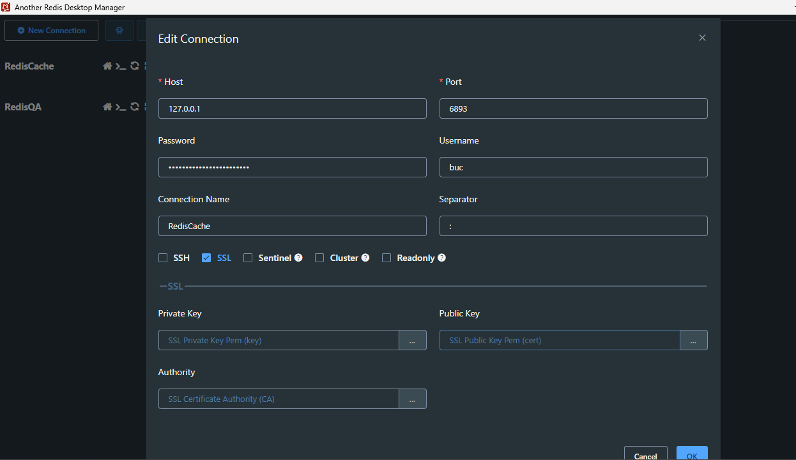

# Paso a Paso para Acceder a una Redis con AWS SSM

## Introduccion:

Este documento describe los pasos necesarios para acceder a una base de datos RDS mediante AWS Session Manager (SSM). El objetivo es configurar y utilizar un port forwarding (redirección de puerto) para conectarse de manera segura a la base de datos.

## Prerrequisitos
Antes de comenzar, asegúrese de cumplir con los siguientes prerrequisitos:

**1. Permisos necesarios:**
- El usuario de aws debe tener permisos para las siguientes acciones en IAM:  SSM
- Permisos para acceder a la instancia EC2 asociada.

**2. Configuración e instalación WSL Ubuntu y Redis-Cli o Another Redis(Windows)**

1. Instalar Another Redis [Guia de instalación](https://goanother.com/)
1. Instalar WSL [Guia instalación WSL](https://learn.microsoft.com/en-us/windows/wsl/install).(**Para redisCli**)
2. Instalar redis-cli con TLS en WSL (**Para redisCli**s)
````
      sudo apt update && sudo apt upgrade -y
````
````
      sudo apt install -y build-essential gcc make pkg-config libssl-dev
````
````
      curl -O http://download.redis.io/redis-stable.tar.gz
````
````
      tar -xzvf redis-stable.tar.gz
````
````
      cd redis-stable
````
````
      make BUILD_TLS=yes
````
````
      sudo mv src/redis-cli /usr/local/bin/
````
````
      redis-cli --version
````
````
      sudo service redis-server stop
````
````
      sudo service redis-server start
````
3. Instalar AWS CLI [Guia instalación AWS CLI](https://docs.aws.amazon.com/cli/latest/userguide/getting-started-install.html)
4. Instalar AWS SSM CLI [Guía Instalación Windows](https://docs.aws.amazon.com/systems-manager/latest/userguide/install-plugin-windows.html)
5. Instalar AWS SSM en WSL ubuntu (**Para redisCli**)
````
      curl -o "session-manager-plugin.deb" "https://s3.amazonaws.com/session-managerdownloads/plugin/latest/ubuntu_64bit/session-manager-plugin.deb"
````  
````  
      curl -o "session-manager-plugin.deb.sig" "https://s3.amazonaws.com/session-managerdownloads/plugin/latest/ubuntu_64bit/session-manager-plugin.deb.sig"
````
````
      sudo apt-get update
````
````
      sudo apt-get install gnupg2
````
````
      gpg --version
````
- Crear archivo
````
      touch session-manager-plugin.gpg
````
````
      nano session-manager-plugin.gpg
````

- Pegar dentro del archivo **session-manager-plugin.gpg**
````
-----BEGIN PGP PUBLIC KEY BLOCK-----
mFIEZ5ERQxMIKoZIzj0DAQcCAwQjuZy+IjFoYg57sLTGhF3aZLBaGpzB+gY6j7Ix
P7NqbpXyjVj8a+dy79gSd64OEaMxUb7vw/jug+CfRXwVGRMNtIBBV1MgU1NNIFNl
c3Npb24gTWFuYWdlciA8c2Vzc2lvbi1tYW5hZ2VyLXBsdWdpbi1zaWduZXJAYW1h
em9uLmNvbT4gKEFXUyBTeXN0ZW1zIE1hbmFnZXIgU2Vzc2lvbiBNYW5hZ2VyIFBs
dWdpbiBMaW51eCBTaWduZXIgS2V5KYkBAAQQEwgAqAUCZ5ERQ4EcQVdTIFNTTSBT
ZXNzaW9uIE1hbmFnZXIgPHNlc3Npb24tbWFuYWdlci1wbHVnaW4tc2lnbmVyQGFt
YXpvbi5jb20+IChBV1MgU3lzdGVtcyBNYW5hZ2VyIFNlc3Npb24gTWFuYWdlciBQ
bHVnaW4gTGludXggU2lnbmVyIEtleSkWIQR5WWNxJM4JOtUB1HosTUr/b2dX7gIe
AwIbAwIVCAAKCRAsTUr/b2dX7rO1AQCa1kig3lQ78W/QHGU76uHx3XAyv0tfpE9U
oQBCIwFLSgEA3PDHt3lZ+s6m9JLGJsy+Cp5ZFzpiF6RgluR/2gA861M=
=2DQm
-----END PGP PUBLIC KEY BLOCK-----
````
- Continuar 
````
      gpg --import session-manager-plugin.gpg
````
````
      gpg --fingerprint 2C4D4AFF6F6757EE
````
````    
      gpg --verify session-manager-plugin.deb.sig session-manager-plugin.deb
````
````    
      curl "https://s3.amazonaws.com/session-manager-downloads/plugin/latest/ubuntu_64bit/session-manager-plugin.deb" -o "session-manager-plugin.deb"
````
````     
      sudo dpkg -i session-manager-plugin.deb
````
````     
      session-manager-plugin


````

## Paso 1: Configuración AWS CLI con SSO

1. Instale AWS CLI si no lo tiene ya instalado.
2. Configure AWS CLI con SSO ejecutando el siguiente comando: `aws configure sso`
3. Complete los pasos interactivos:
     - **SSO session name (Recommended):** `custom`
     - **SSO start URL:** `https://bancoserfinanza.awsapps.com/start/#`
     - **SSO region:**  `us-east-1`
     - **SSO registration scopes:** `sso:account:access` (**Valor por defecto**)
     - Redirecciona a pagina AWS, se debe ingresar las credenciales.
     - **Account ID y role:** Seleccione el ID de cuenta y el rol deseado.
     - **CLI default client Region [None]:** `us-east-1`
     - **CLI default output format [None]:** `json`
     - **CLI profile name [Rol-selecionado-ID_CUENTA]:** `custom` (Mismo nombre del SSO session name)
     - **Nombre del perfil:** Use un Nombre custom como nombre del perfil.
4.	Verifique la configuración del perfil ejecutando: `aws configure list-profiles`
5.	Asegúrese de que `custom` esté listado.

## Paso 2: Iniciar Redirección de Puerto con AWS SSM

1. Inciar sesión con `aws sso login --profile <PERFIL_CREADO>`
1. Ejecute el siguiente comando para iniciar una sesión SSM con redirección de puerto:
````
aws ssm start-session --target <ID_DE_LA_INSTANCIA> --document-name AWS-StartPortForwardingSessionToRemoteHost --parameters '{"host":["<ENDPOINT_REDIS>"],"portNumber":["6893"],"localPortNumber":["6893"]}' --profile <PERFIL_CREADO>
````
> **Note**
> Reemplace <ID_DE_LA_INSTANCIA> con el ID de la instancia EC2, reemplace <ENDPOINT_REDIS> con el endpoint de la base de datos RDS, reemplace <PERFIL_CREADO> ejemplo: `custom`

## Paso 3: Conectar a la Base de Datos por redisCLI
`redis-cli -h 127.0.0.1 -p 6893 --tls --user <USER> --askpass`
## Paso 3: Conectar a la Base de Datos por Another Redis

>[!NOTE]
>
>This is a standard NOTE block.
